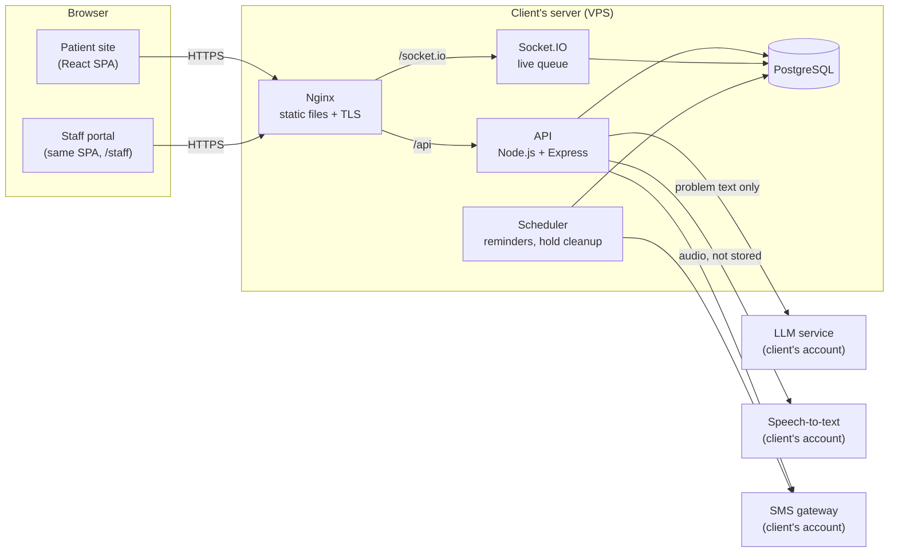
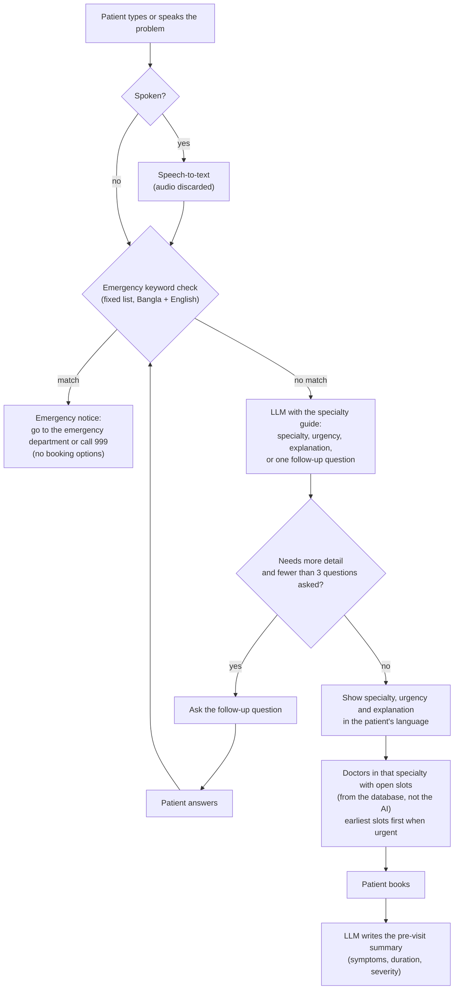

# System design

Design for the AI-Assisted Doctor Suggestion and Appointment System (SOW #001, revision 1). It
covers the SOW task "Design the system architecture, database and user interface" and the
deliverable "System design document: use case, class, sequence and activity diagrams, ER diagram and
UI wireframes".

| Document                    | Contents                                                            |
| --------------------------- | ------------------------------------------------------------------- |
| This page                   | Goals, architecture, technology, AI pipeline, security and privacy  |
| [Data model](data-model.md) | ER diagram, tables, constraints, slot locking                       |
| [API contract](api.md)      | REST endpoints, payloads, errors, realtime events                   |
| [UML diagrams](uml.md)      | Use case, class, sequence, activity and state diagrams              |
| [Screens](screens.md)       | Screen inventory per role and the Milestone 1 demo script           |
| [Wireframes](wireframes/)   | Low-fidelity wireframe of every screen, with notes (SVG, for Figma) |

Status: **draft v0.1, 28 September 2026.** Written before the requirements interviews; items marked
_To confirm_ are questions for those interviews.

## 1. Goals the design must meet

These come straight from the SOW and drive the decisions below.

1. **Anyone can ask the AI assistant**, in Bangla or English, by typing or speaking, without an
   account. Booking needs a phone number verified by OTP.
2. **Two patients can never book the same slot.** A slot is held for 5 minutes while the patient
   confirms.
3. **Emergencies never reach the booking flow.** A fixed keyword check runs before the AI.
4. **The live queue updates as the front desk calls each patient.**
5. **The frontend is built first on sample data** and must connect to the real backend without
   being rewritten.
6. **Only the problem description and follow-up answers go to the AI service**, never the
   patient's name or phone number.
7. Runs on the client's hosting; running costs (hosting, SMS, AI) are the client's.

## 2. Architecture



| Part           | Responsibility                                                                        |
| -------------- | ------------------------------------------------------------------------------------- |
| React SPA      | All patient and staff screens, Bangla/English, mobile-first                           |
| API            | REST endpoints, validation, auth, booking rules, AI orchestration                     |
| Socket.IO      | Pushes queue changes to patients and staff watching a doctor's session                |
| Scheduler      | Sends reminder SMS at the admin-set time; clears expired slot holds                   |
| PostgreSQL     | All data; enforces "one active booking per slot" with a unique index                  |
| LLM service    | Specialty and urgency suggestion, follow-up questions, explanation, pre-visit summary |
| Speech-to-text | Turns a spoken problem into text; the audio is discarded after transcription          |
| SMS gateway    | OTP codes, confirmations, reschedules, cancellations, reminders                       |

The API, Socket.IO server and scheduler run in one Node.js process at this hospital's scale. They
are separate modules, so they can be split later without code changes.

### 2.1 Technology

| Layer    | Choice                                                        | Why                                                       |
| -------- | ------------------------------------------------------------- | --------------------------------------------------------- |
| Frontend | React 19, Vite, TypeScript, Tailwind CSS, React Router        | Decision D1; fast builds, typed end to end                |
| Data     | TanStack Query over a typed `fetch` client                    | Caching, refetch on focus, simple cache invalidation      |
| i18n     | i18next; Bangla digits and dates via `Intl` (`bn-BD`)         | Patients read Bangla; staff may prefer English            |
| Mock API | Mock Service Worker (MSW) in the browser                      | Milestone 1 without a backend; same URLs and payloads     |
| Backend  | Node.js 22, Express, TypeScript                               | Decision D1                                               |
| Database | PostgreSQL 16 with Prisma migrations                          | Partial unique indexes for slot locking; typed queries    |
| Realtime | Socket.IO                                                     | Rooms per doctor session; reconnects on flaky mobile data |
| Tests    | Vitest (unit), Playwright (end-to-end)                        | Same runner for web, shared code and API                  |
| Shared   | `packages/shared`: types, domain rules, sample-data generator | One definition of slots, queue and emergency rules        |

### 2.2 Frontend first, backend later

The frontend never imports sample data directly. Every screen calls the typed API client
(`apps/web/src/api`), which sends real HTTP requests to `/api/v1/...`. In Milestone 1, MSW answers
those requests inside the browser from generated sample data. When the backend exists, MSW is
switched off (`VITE_API_MOCK=false`) and the same requests reach Express.

The mock keeps its data in the browser's local storage, so a demo can use two tabs: the front desk
calls the next patient in one and the patient's live queue moves in the other.

### 2.3 Deployment

The client provides a Linux VPS (or another host that runs Node.js) and a domain. Nginx serves the
built frontend, terminates TLS and proxies `/api` and `/socket.io` to the Node.js process, which runs
under a process manager (systemd or PM2). PostgreSQL runs on the same machine with daily backups.
_To confirm:_ the client's hosting. Plain cPanel shared hosting cannot run this stack.

## 3. AI pipeline



- **The keyword check runs on every message**, including follow-up answers, before anything is
  sent to the LLM. It lives in `packages/shared/src/emergency.ts` so the frontend can show the notice
  instantly and the API enforces it again. _To confirm:_ the keyword list with the client's doctors.
- **The LLM only picks from the client's specialty list.** The prompt includes the specialty guide
  (specialties and the problems each treats) and requires a JSON answer. The API rejects any
  specialty that is not in the list and falls back to Medicine.
- **Doctor suggestions come from the database**, never from the LLM, so the AI cannot invent
  doctors or slots.
- **What is sent:** the problem text and follow-up answers only. Names, phone numbers and patient
  IDs never leave the server.
- **Accuracy target:** the suggested specialty matches the client doctor's choice in at least 80% of
  the AI test set. A script runs the test set against the pipeline and reports the match rate.
- **Milestone 1:** the mock API uses a keyword-based stand-in for the LLM (`packages/shared/src/triage-mock.ts`).
  It follows the same request and response shape, so the screens do not change.

## 4. Booking rules

- **Slots** come from each doctor's schedule rules: chamber day, start and end time, slot length and
  patient limit. A session has `min(limit, duration ÷ slot length)` slots. Serial numbers follow slot
  order.
- **Hold:** choosing a slot creates an appointment in status `held` that expires after 5 minutes.
  Confirming turns it into `booked`. Expired holds free the slot.
- **No double booking:** a partial unique index allows only one appointment per doctor, date and
  start time while its status is active (see [Data model](data-model.md#slot-locking)).
- **Reschedule** holds the new slot first, then confirming it cancels the old appointment in the same
  transaction. The patient never ends up with zero or two bookings.
- **Leave day:** adding one cancels every active appointment for that doctor on that date and sends
  each patient an SMS.
- **Front-desk booking:** staff find or register a patient by phone number (no OTP, since the patient
  is on the phone or at the desk) and book directly. The same unique index protects the slot.

## 5. Live queue

The front desk's "call next patient" marks the current patient as seen and calls the arrived patient
with the lowest serial. Patients who have not arrived are skipped and can be called later.

For a patient with serial _s_, where _ahead_ counts the patients still waiting before them (booked or
arrived, lower serial) plus the one in consultation:

```
estimated time = later of ( scheduled slot time of s ,  now + ahead × slot length )
```

Every change publishes `queue:changed` to the Socket.IO room for that doctor and date; clients then
refetch the queue status.

## 6. Security and privacy

- **Patients** sign in with phone number + OTP (6 digits, 5-minute expiry, 5 attempts, rate-limited
  per phone and IP). **Staff** sign in with username + password (bcrypt). Sessions are HTTP-only,
  `SameSite=Lax`, secure cookies.
- **Roles:** `admin`, `front_desk`, `doctor`. A doctor sees only their own appointments.
- **Stored patient data** is limited to what the SOW lists: name, phone, age, sex, described problem
  with follow-up answers and pre-visit summary, and appointment history. Voice recordings are not
  stored.
- **Sample data** uses invented names. Its phone numbers have the Bangladeshi format, so test
  environments must use the SMS gateway's sandbox mode or a test sender.
- All input is validated on the server with the shared schemas; the frontend validation is only for
  convenience.

## 7. Open questions for the requirements interviews

1. Which specialties and doctors take part, and what are their chamber days, times, slot lengths and
   patient limits?
2. Should "peak hours" in analytics mean the hours with most appointments or the hours when most
   bookings are made? (The design assumes appointment hours.)
3. How long before a session should online booking close?
4. Can a patient hold more than one upcoming appointment with the same doctor?
5. What should the reminder SMS say, and does the hospital have an approved SMS sender name?
6. Who reviews the emergency keyword list and the specialty guide?
