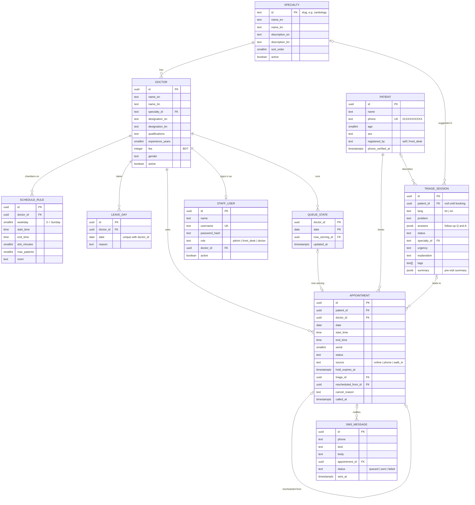
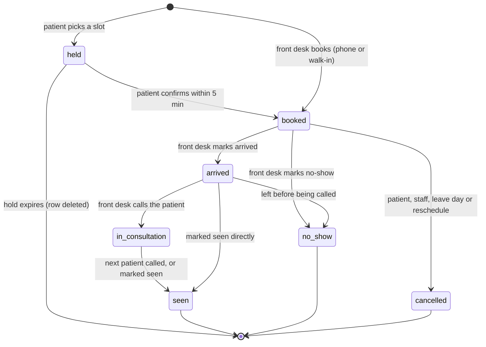

# Data model

PostgreSQL 16. All times are Asia/Dhaka (UTC+6, no daylight saving). Appointment dates are stored as
`date` and chamber times as `time`, both in Dhaka local time; audit timestamps are `timestamptz`.
The TypeScript shapes the API returns are in [`packages/shared/src/types.ts`](../../packages/shared/src/types.ts).

## ER diagram



Two supporting tables are left out of the diagram: `otp_code` (phone, code hash, expiry, attempts)
and `setting` (key, JSON value).

## Tables

| Table            | Notes                                                                                         |
| ---------------- | --------------------------------------------------------------------------------------------- |
| `specialty`      | The client's specialty list. The AI may only suggest one of these.                            |
| `doctor`         | Profile shown to patients. Deactivating hides the doctor without losing history.              |
| `schedule_rule`  | One row per weekly chamber session. A doctor can have several per day (morning and evening).  |
| `leave_day`      | Inserting one cancels that day's active appointments and queues SMS (one transaction).        |
| `patient`        | Only what booking needs: name, phone, age, sex.                                               |
| `appointment`    | The booking and its live status. `serial` is the position in the session.                     |
| `triage_session` | The AI conversation. No name or phone. Linked to the patient only when they book.             |
| `queue_state`    | Which appointment each doctor is seeing now, per date.                                        |
| `staff_user`     | Admin, front-desk and doctor accounts. A doctor account links to one `doctor` row.            |
| `sms_message`    | Every SMS the system sends, for audit and retry. OTP bodies are stored with the code masked.  |
| `otp_code`       | Hashed one-time codes; 5-minute expiry, 5 attempts.                                           |
| `setting`        | `reminder` (`daysBefore`, `time`, default 1 day before at 19:00); `booking` (`openDays`, 14). |

## Appointment status



`cancel_reason` is one of `patient`, `staff`, `leave_day` or `rescheduled`.

## Slot locking

"Two patients can never book the same slot" is enforced by the database, not only by the API:

```sql
CREATE UNIQUE INDEX appointment_one_per_slot
  ON appointment (doctor_id, date, start_time)
  WHERE status <> 'cancelled';
```

Booking a slot runs in one transaction:

1. Delete any expired hold on that slot:
   `DELETE FROM appointment WHERE doctor_id = $1 AND date = $2 AND start_time = $3 AND status = 'held' AND hold_expires_at < now();`
2. Insert the new appointment with `status = 'held'` and `hold_expires_at = now() + interval '5 minutes'`.
3. A unique-index violation means someone else holds or booked the slot: return `409 SLOT_TAKEN`.

Confirming updates the row to `booked` only if the hold is still valid
(`WHERE id = $1 AND status = 'held' AND hold_expires_at > now()`); otherwise it returns
`410 HOLD_EXPIRED`. The scheduler also deletes expired holds every minute so they stop showing as
taken.

Front-desk bookings skip the hold and insert `booked` directly; the same index protects them.

## Indexes

| Index                                   | Used by                            |
| --------------------------------------- | ---------------------------------- |
| `appointment (doctor_id, date, serial)` | Queue, front-desk and doctor lists |
| `appointment (patient_id, date)`        | My appointments                    |
| `appointment (date, status)`            | Reminders, analytics               |
| `patient (phone)` unique                | Login, front-desk search           |
| `leave_day (doctor_id, date)` unique    | Availability                       |
| `triage_session (created_at)`           | Analytics, retention clean-up      |

## Retention

- Triage sessions that never lead to a booking hold no identity. _To confirm:_ delete them after 90
  days.
- `otp_code` rows are deleted after 24 hours.
