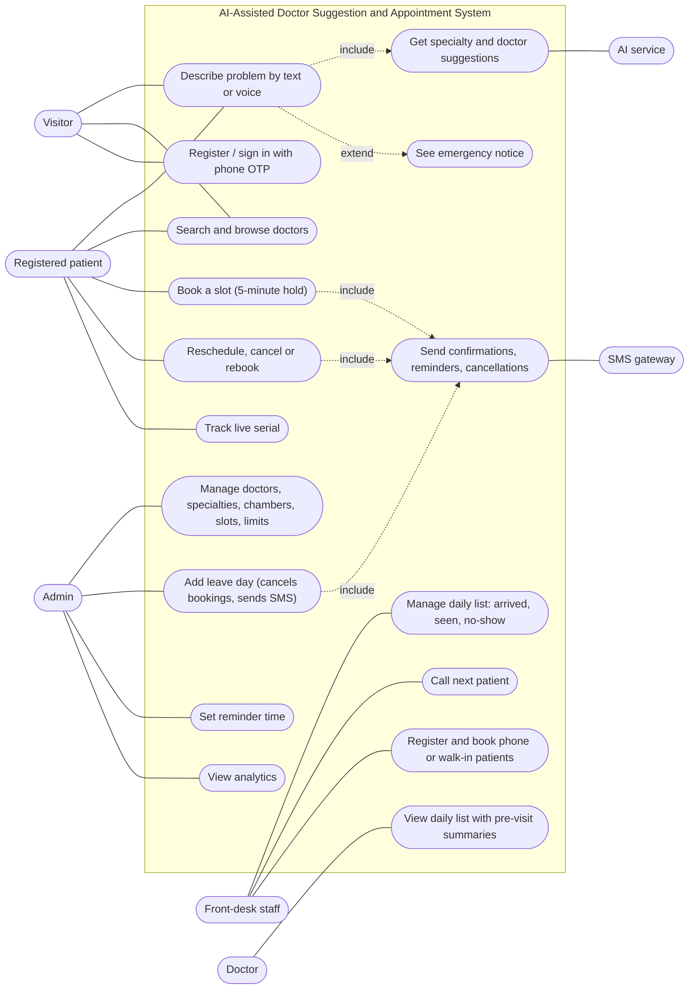
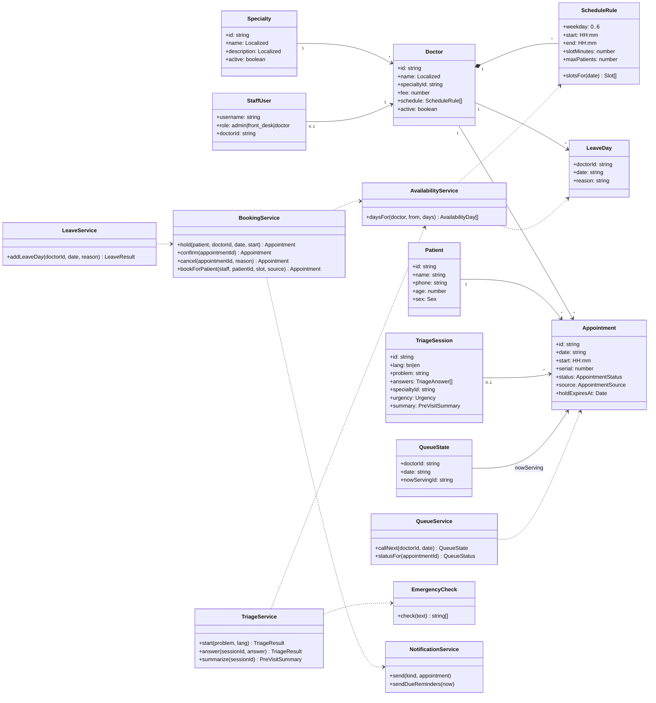
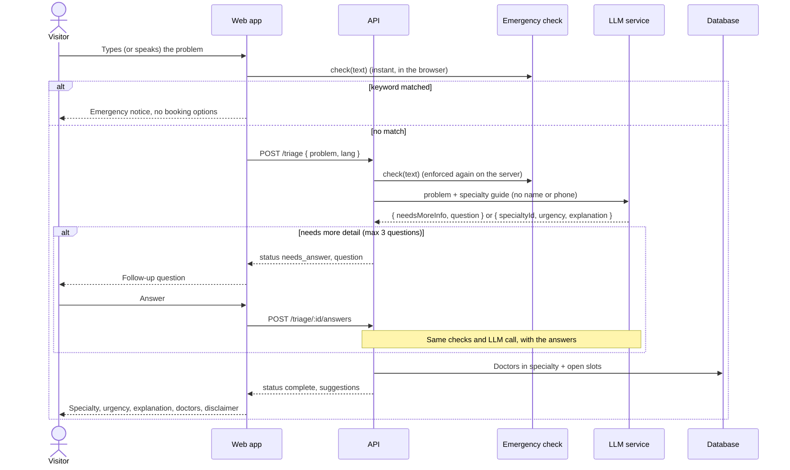
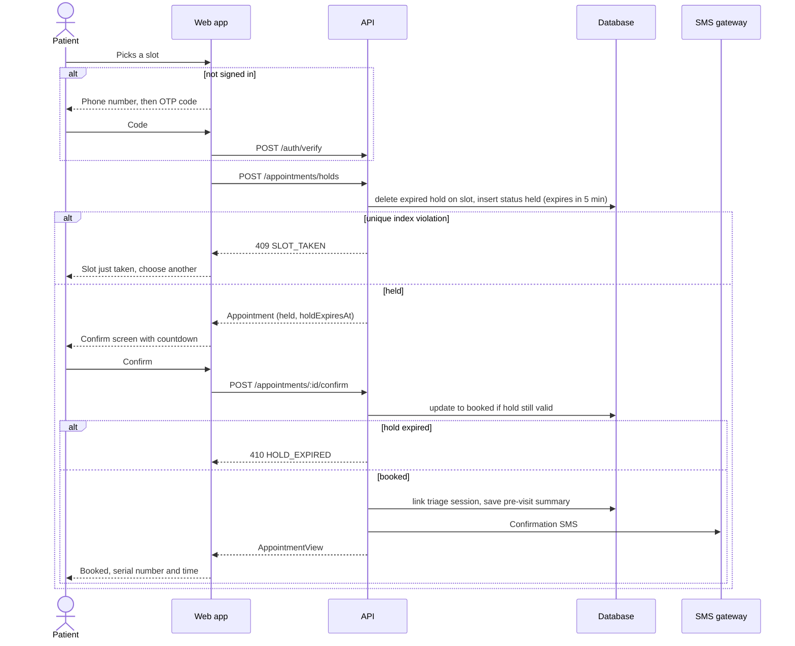
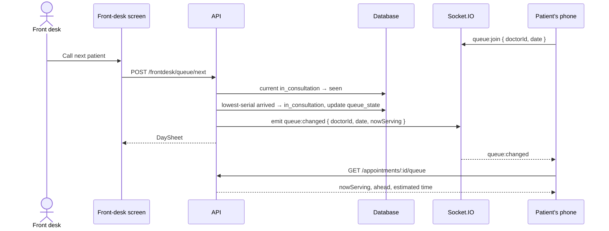
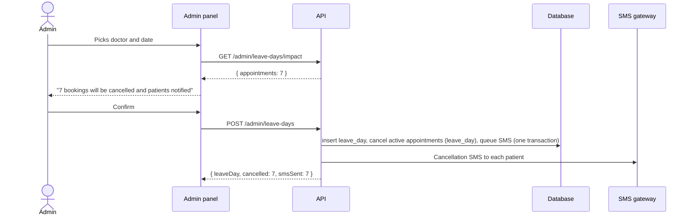
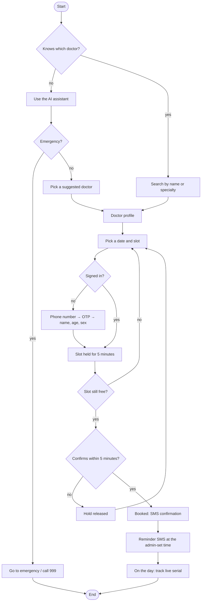
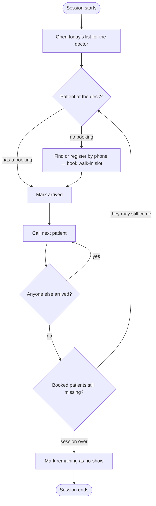

# UML diagrams

All diagrams are Mermaid, so they render on GitHub and can be exported for the Word version of the
design document. The appointment state diagram is in [Data model](data-model.md#appointment-status).

## Use case diagram

Mermaid has no use case diagram type, so actors are drawn as rounded nodes and use cases as stadium
shapes inside the system boundary.

## Class diagram

Domain classes and the backend services that act on them. Services map to modules in `apps/api`.

## Sequence: AI assistant to suggestion

## Sequence: booking with a 5-minute hold

## Sequence: front desk calls the next patient

## Sequence: admin adds a leave day

## Activity: patient books an appointment

## Activity: front desk runs a session

